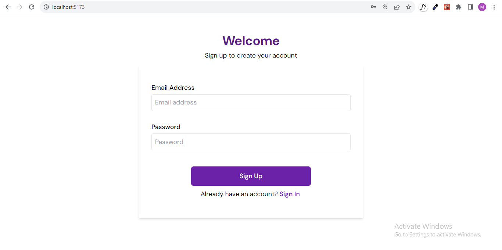

# Drag and Drop Image Gallery

[Link to live site](https://sortable-gallery.netlify.app)

**Login using this details**

**Email**: user@example.com
**Password**: 1Password

## Project Overview

This is a wep application that features a responsive image gallery with drag-and-drop functionality. Users can sign up to view images,sort them using the drag and drop feature, as well as search for images based on their tags.

## Key Features

- Drag-and-Drop functionality : Users can rearrange images within the gallery
- Search functionality : Search for images by their tags.
- User authentication : Securely login with their email and password
- Responsive design : The site is responsive across all devices

## Tecnologies Used

- **Frontend:** React JS, Tailwind CSS, Vite.
- **Authentication:** Firebase.
- **Packages:** React router, DnD Kit.

## Setting up the project

The following are instructions on how to set up the project locally

1. Clone the repository
   The first thing you'll do is to open up your terminal and clone this repository. You can use Gitbash or the Command Prompt to run the command below

`git clone https://github.com/MutiatBash/sortable-gallery.git`

2. Navigate to the project directory
   ` cd sortable-gallery`

3. Install dependencies
   In building this projects, some packages were installed to enable some functionalities. To install them run the following command
   `npm install`

4. Start the development server
   Once the installation has been completed, run the following command to start the server
   ` npm run dev`

5. View the project
   On your terminal, after running the command above, you'll see a link to view the project
   - [http://localhost:5173](http://localhost:5173) click on the link and you'll be directed to your browser to view.
   - 
     

## Troubleshooting and Errors

While setting up the project, you might come across some errors, here are ways to troubleshoot them

- **Dependency Issues:**
  - If you encounter problems with installing dependencies, ensure that you have Node.js and npm installed on your system.
  - Also ensure that you are connected to a strong network during installation.
- **Authentication:**
  - Ensure that you use the correct email and password when signing in or signing up.
  - You have to be connect to the internet to be able to sign in or sign up.

If you encounter any other error, you can search for the error message on google or use StackOverflow to find possible solutions.
